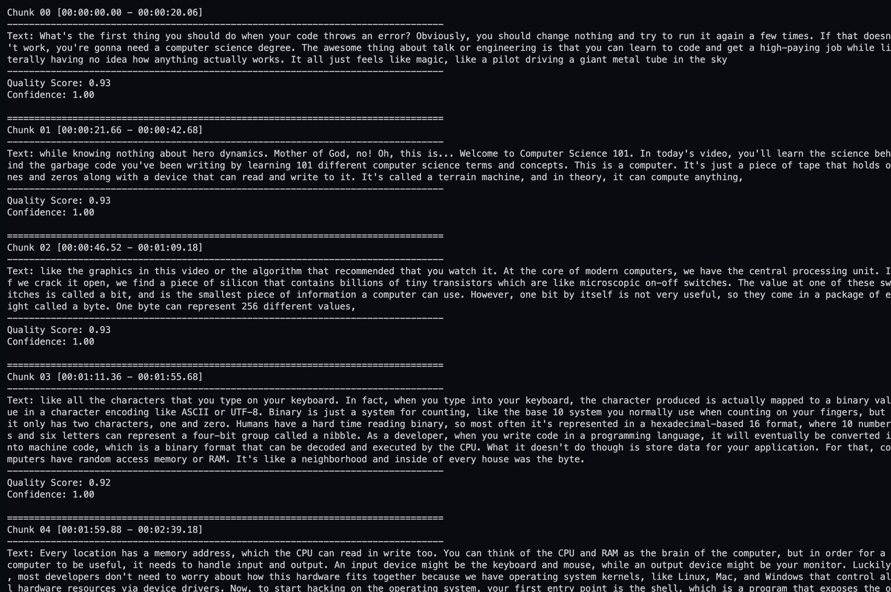
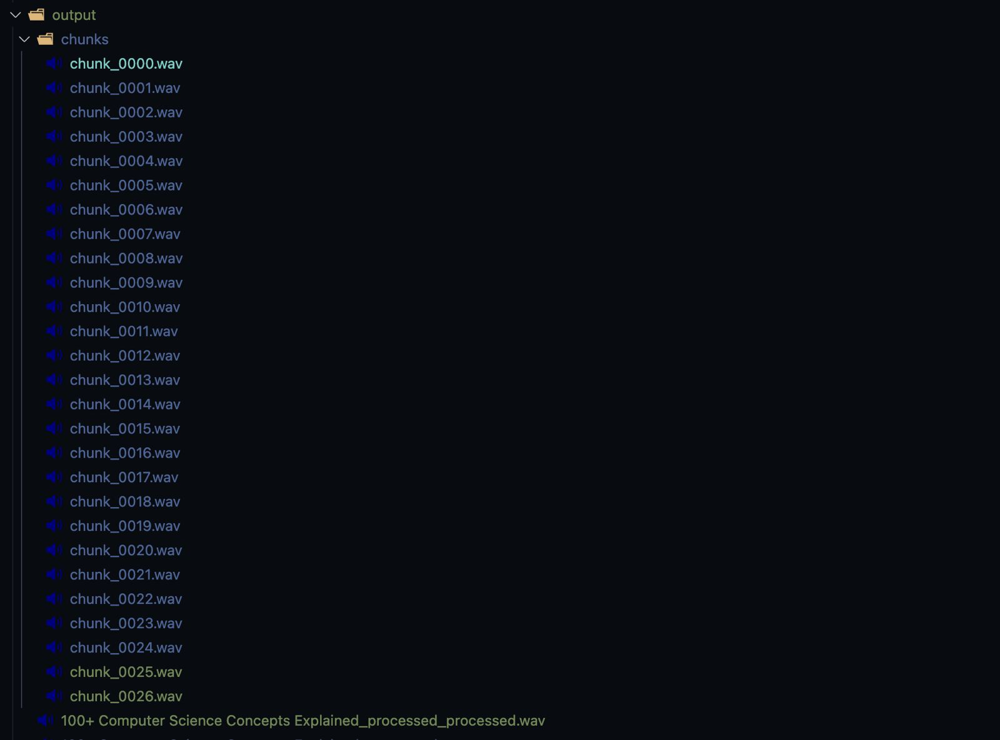
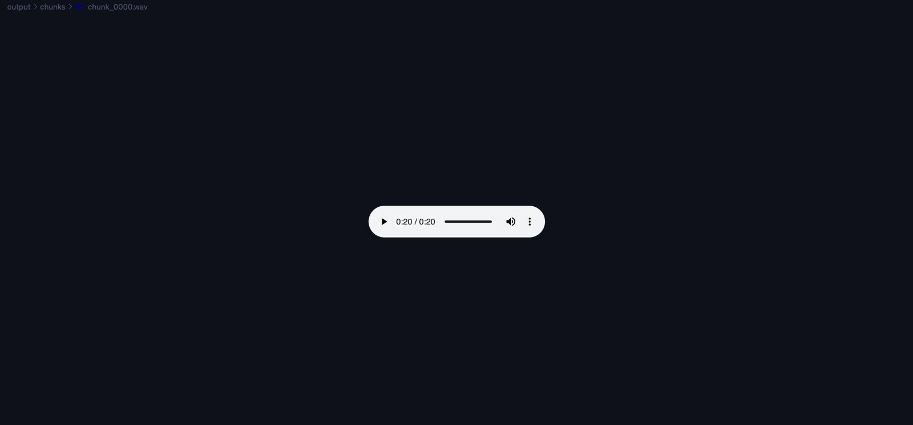
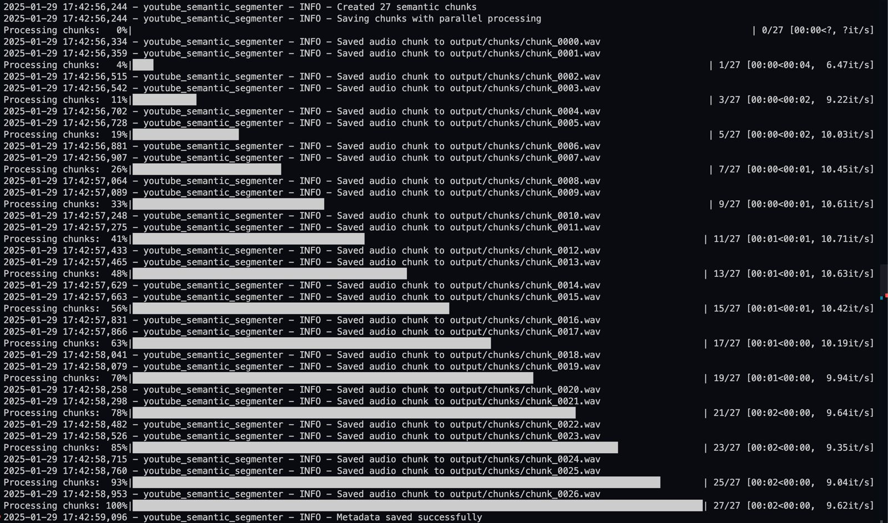
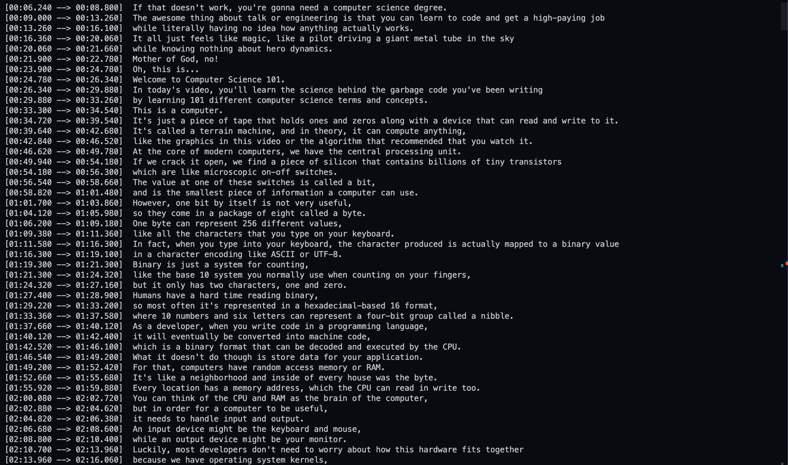

# YouTube Semantic Segmenter 🎬

A powerful Streamlit application that segments YouTube videos into semantically meaningful chunks with high-quality transcripts. Built with OpenAI's Whisper model and advanced semantic analysis.

## ✨ Features

-  🎯 **Intelligent Segmentation**: Splits videos into meaningful chunks based on semantic content
-  🔊 **High-Quality Transcription**: Uses OpenAI's Whisper model for accurate transcription
-  📊 **Advanced Analytics**: Visualize chunk quality, duration distribution, and more
-  ⚙️ **Configurable Settings**: Customize model size, chunk duration, and processing options
-  📥 **Multiple Export Options**: Download audio chunks and transcripts
-  🌐 **Multi-Language Support**: Automatic language detection and transcription
-  🔄 **Batch Processing**: Process multiple videos efficiently

## 🚀 Quick Start

1. Clone the repository:

```bash
git clone https://github.com/achalbajpai/youtube-semantic-segmenter.git
cd youtube-semantic-segmenter
```

2. Create and activate a virtual environment:

```bash
python -m venv venv
source venv/bin/activate  # On Windows: venv\Scripts\activate
```

3. Install dependencies:

```bash
pip install -r requirements.txt
```

4. Run the Streamlit app:

```bash
cd streamlit_app
streamlit run Home.py
```

5. Open your browser and navigate to `http://localhost:8501`

## 🛠️ Configuration

### Model Settings

-  Choose between different Whisper model sizes:
   -  `tiny`: Fastest but less accurate
   -  `base`: Good balance of speed and accuracy
   -  `small`: Better accuracy, slower processing
   -  `medium`: High accuracy, slower processing
   -  `large-v3`: Best accuracy, slowest processing

### Audio Processing

-  Configure sample rate and audio format
-  Enable/disable audio preprocessing
-  Adjust silence removal settings

### Chunking Settings

-  Set minimum and maximum chunk durations
-  Configure overlap between chunks
-  Adjust quality validation thresholds

## 📊 Analytics

The application provides comprehensive analytics:

-  **Duration Distribution**: Analyze chunk length patterns
-  **Quality Metrics**: Monitor transcription quality and confidence
-  **Processing Timeline**: Track processing history
-  **Text Analysis**: Evaluate transcript characteristics

## 🔧 System Requirements

-  Python 3.9+
-  FFmpeg
-  4GB+ RAM (8GB+ recommended for large models)
-  CUDA-compatible GPU (optional, for faster processing)

## 📦 Dependencies

Main dependencies include:

-  `streamlit`: Web application framework
-  `openai-whisper`: Speech recognition model
-  `plotly`: Interactive visualizations
-  `pandas`: Data manipulation
-  `torch`: Deep learning framework
-  `transformers`: NLP tools
-  `yt-dlp`: YouTube video download

For a complete list, see `requirements.txt`.

## 🤝 Contributing

Contributions are welcome! Please feel free to submit a Pull Request. For major changes, please open an issue first to discuss what you would like to change.

1. Fork the repository
2. Create your feature branch (`git checkout -b feature/AmazingFeature`)
3. Commit your changes (`git commit -m 'Add some AmazingFeature'`)
4. Push to the branch (`git push origin feature/AmazingFeature`)
5. Open a Pull Request

## 📝 License

This project is licensed under the MIT License - see the [LICENSE](LICENSE) file for details.

## 🙏 Acknowledgments

-  [OpenAI Whisper](https://github.com/openai/whisper) for the speech recognition model
-  [Streamlit](https://streamlit.io/) for the web application framework
-  [yt-dlp](https://github.com/yt-dlp/yt-dlp) for YouTube video downloading

## 📧 Support

Need help? You can:

-  Open an [issue](https://github.com/achalbajpai/youtube-semantic-segmenter/issues)
-  Check the [documentation](https://github.com/achalbajpai/youtube-semantic-segmenter/wiki)
-  Contact the maintainers

## 🌟 Star History

[](https://star-history.com/#achalbajpai/youtube-semantic-segmenter&Date)

## 📸 Screenshots

### Streamlit Interface


### Processing Output



### Chunk Creation Process





